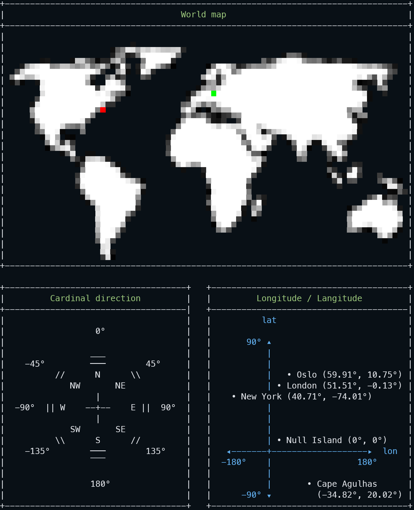

# PHP Coordinate

[](https://github.com/ixnode/php-coordinate/releases)
[](https://github.com/ixnode/php-coordinate/releases)

[](https://www.php.net/supported-versions.php)
[](https://phpstan.org/user-guide/rule-levels)
[](https://phpunit.de)
[](https://www.php-fig.org/psr/psr-12/)
[](https://github.com/phpmd/phpmd)
[](https://github.com/rectorphp/rector)
[](https://github.com/ixnode/php-api-version-bundle/blob/master/LICENSE)

> This library offers a collection of various PHP coordinate classes like Coordinate, etc.
> It converts various coordinate strings and values into a unique format.

## 1. Usage

```php
use Ixnode\PhpCoordinate\Coordinate;
```

### 1.1 Converter example

```php
$coordinate = new Coordinate(51.0504, 13.7373);

print $coordinate->getLatitudeDMS();
// (string) 51°3′1.44″N

print $coordinate->getLongitudeDMS();
// (string) 13°44′14.28″E
```

### 1.2 Parser example

```php
$coordinate = new Coordinate('51°3′1.44″N 13°44′14.28″E');

print $coordinate->getLatitude();
// (float) 51.0504

print $coordinate->getLongitude();
// (float) 13.7373
```

### 1.3 Distance example

```php
$coordinateDresden = new Coordinate('51°3′1.44″N 13°44′14.28″E');
$coordinateCordoba = new Coordinate(-31.425299, -64.201743);

/* Distance between Dresden, Germany and Córdoba, Argentina */
print $coordinate->getDistance($coordinateCordoba, Coordinate::RETURN_KILOMETERS);
// (float) 11904.668
```

## 2. Parser

### 2.1 Basic decimal degree parser

#### 2.1.1 Parser formats

| Given value (string)              | Latitude (float) | Longitude (float) | Place              |
|-----------------------------------|------------------|-------------------|--------------------|
| `"51.0504,13.7373"`               | _51.0504_        | _13.7373_         | Dresden, Germany   |
| `"51.0504, 13.7373"`              | _51.0504_        | _13.7373_         | Dresden, Germany   |
| `"51.0504 13.7373"`               | _51.0504_        | _13.7373_         | Dresden, Germany   |
| `"POINT(-31.425299, -64.201743)"` | _-31.425299_     | _-64.201743_      | Córdoba, Argentina |
| `"POINT(-31.425299 -64.201743)"`  | _-31.425299_     | _-64.201743_      | Córdoba, Argentina |

#### 2.1.2 Code example

```php
$coordinate = new Coordinate('51.0504 13.7373');

print $coordinate->getLatitude();
// (float) 51.0504

print $coordinate->getLongitude();
// (float) 13.7373
```

### 2.2 Basic DMS Parser

#### 2.2.1 Parser formats

| Given value (string)                       | Latitude (float) | Longitude (float) | Place              |
|--------------------------------------------|------------------|-------------------|--------------------|
| `"51°3′1.44″N,13°44′14.28″E"`              | _51.0504_        | _13.7373_         | Dresden, Germany   |
| `"51°3′1.44″N, 13°44′14.28″E"`             | _51.0504_        | _13.7373_         | Dresden, Germany   |
| `"51°3′1.44″N 13°44′14.28″E"`              | _51.0504_        | _13.7373_         | Dresden, Germany   |
| `"POINT(31°25′31.0764″S, 64°12′6.2748″W)"` | _-31.425299_     | _-64.201743_      | Córdoba, Argentina |
| `"POINT(31°25′31.0764″S 64°12′6.2748″W)"`  | _-31.425299_     | _-64.201743_      | Córdoba, Argentina |

#### 2.2.2 Code example

```php
$coordinate = new Coordinate('51°3′1.44″N 13°44′14.28″E');

print $coordinate->getLatitude();
// (float) 51.0504

print $coordinate->getLongitude();
// (float) 13.7373
```

### 2.3 Google Url Parser Parser

#### 2.3.1 Parser formats

| Given value (string)                                   | Latitude (float) | Longitude (float) | Place            |
|--------------------------------------------------------|------------------|-------------------|------------------|
| Copied Google Maps Short Url<sup><code>1)</code></sup> | _54.07304830_    | _18.992402_       | Malbork, Poland  |
| Copied Google Maps Link<sup><code>2)</code></sup>      | _51.31237_       | _12.4132924_      | Leipzig, Germany |

* <sup><code>1)</code></sup> [Copied Google Maps Short Url](https://maps.app.goo.gl/PHq5axBaDdgRWj4T6)
* <sup><code>2)</code></sup> [Copied Google Maps Link](https://www.google.com/maps/place/V%C3%B6lkerschlachtdenkmal,+04277+Leipzig/@51.3123709,12.4132924,17z/data=!3m1!4b1!4m6!3m5!1s0x47a6f9a9d013ca23:0x277b49a142da988c!8m2!3d51.3123709!4d12.4132924!16s%2Fg%2F12ls2f87w?entry=ttu)

#### 2.3.2 Code example

```php
$coordinate = new Coordinate('https://maps.app.goo.gl/PHq5axBaDdgRWj4T6');

print $coordinate->getLatitude();
// (float) 54.07304830

print $coordinate->getLongitude();
// (float) 18.992402
```

## 3. Converter

### 3.1 Methods of class `Coordinate`

| Method            | Type     | Parameter                                              | Description                                                 | Example             |
|-------------------|----------|--------------------------------------------------------|-------------------------------------------------------------|---------------------|
| `getLatitude`     | _float_  | ---                                                    | Returns the decimal degree presentation of latitude value.  | _-31.425299_        |
| `getLongitude`    | _float_  | ---                                                    | Returns the decimal degree presentation of longitude value. | _-64.201743_        |
| `getLatitudeDD`   | _float_  | ---                                                    | Alias of `getLatitude`.                                     | _-31.425299_        |
| `getLongitudeDD`  | _float_  | ---                                                    | Alias of `getLongitude`.                                    | _-64.201743_        |
| `getLatitudeDMS`  | _string_ | ---                                                    | Returns the dms representation of the latitude value.       | `"31°25′31.0764″S"` |
| `getLongitudeDMS` | _string_ | ---                                                    | Returns the dms representation of the longitude value.      | `"64°12′6.2748″W"`  |
| `getLatitudeDMS`  | _string_ | `CoordinateValue::FORMAT_DMS_SHORT_2`                  | Returns the dms representation of the latitude value (v2).  | `"S31°25′31.0764″"` |
| `getLongitudeDMS` | _string_ | `CoordinateValue::FORMAT_DMS_SHORT_2`                  | Returns the dms representation of the longitude value (v2). | `"W64°12′6.2748″"`  |
| `getDistance`     | _float_  | `new Coordinate()`, `meters` (default) or `kilometers` | Returns the distance to given second Coordinate instance.   | `11904.668`         |

### 3.2 Code example

```php
$coordinate = new Coordinate('-31.425299, -64.201743');

print $coordinate->getLatitudeDMS();
// (string) "31°25′31.0764″S"

print $coordinate->getLongitudeDMS();
// (string) "64°12′6.2748″W"
```

## 4. Installation

```bash
composer require ixnode/php-coordinate
```

```bash
vendor/bin/php-coordinate -V
```

```bash
php-coordinate 0.1.0 (03-07-2023 01:17:26) - Björn Hempel <bjoern@hempel.li>
```

## 5. Command line tool

> Used to quickly check two given coordinates.

Check Dresden, Germany and New York, United States:

```bash

Source coordinate (51°3′1.44″N, 13°44′14.28″E):

+---------+------------------+--------------------+
| Value   | Latitude         | Longitude          |
+---------+------------------+--------------------+
| Decimal | 51.0504          | 13.7373            |
| DMS     | 51°3′1.44″N      | 13°44′14.28″E      |
+---------+------------------+--------------------+

Target coordinate (40.712784, -74.005941):

+---------+----------------------+---------------------+
| Value   | Latitude             | Longitude           |
+---------+----------------------+---------------------+
| Decimal | 40.712784            | -74.005941          |
| DMS     | 40°42′46.0224″N      | 74°0′21.3876″W      |
+---------+----------------------+---------------------+

Distance:

+-----------+-------------+
| Key       | Value       |
+-----------+-------------+
| Distance  | 6478.472 km |
| Degree    | -96.720°    |
| Direction | W           |
+-----------+-------------+

+------------------------------------------------------------------------------------------------------------------------+
|                                                                                                                        |
|                                                                                                                        |
|                                ▄▄▄▀▀▀▀▀▀▀▀▀▀▀▀▀▀▀▀▀▀                                                                   |
|                    ▄▄▄▄ ▄     ▄▀▀▀▀  ▀▀▀▀▀▀▀▀▀▀▀▀▀▀                            ▄▄▄▀▀▀▀▀▀                               |
|     ▄▄▄▄▀▀▀▀▀▄▄▄▄▄▄▀▀▀▀▀▀ ▄▀▀▀▀▀▀▀▀▄  ▄▄▀▀▀▀▀▀▀▀▀           ▄▄▀▀▀▄▄▄▄ ▄▄▄▄▄▀▀▀▀▀▀▀▀▀▀▀▀▀▀▀▀▀▀▀▀▀▀▀▀▀▀▀▀▀▄▄▄▄▄▄▄▄▄      |
|  ▄▀▀▀▀▀▀▀▀▀▀▀▀▀▀▀▀▀▀▀▀▀▀▀▀▀▀▀▀ ▄▀▀▀▀  ▀▀▀▀▀▀▀             ▄▀▀▀▀▀▀▀▀▀▀▀▀▀▀▀▀▀▀▀▀▀▀▀▀▀▀▀▀▀▀▀▀▀▀▀▀▀▀▀▀▀▀▀▀▀▀▀▀▀▀▀▀▀▀▀▀▀   |
| ▀▀▀▀▀▀▀▀▀▀▀▀▀▀▀▀▀▀▀▀▀▀▀▀▀   ▄▀▀▀▄▀▀    ▀▀▀               ▀▀▀▀▀▀▀▀▀▀▀▀▀▀▀▀▀▀▀▀▀▀▀▀▀▀▀▀▀▀▀▀▀▀▀▀▀▀▀▀▀▀▀▀▀▀▀▀▀▀▀▀▀▀▀▀▀     |
|          ▀▀▀▀▀▀▀▀▀▀▀▀▀▀▀▀▀▄▄▀▀▀▀▀▀▀▄                     ▄▄▀▀▀▀▀▀▀▀▀▀▀▀▀▀▀▀▀▀▀▀▀▀▀▀▀▀▀▀▀▀▀▀▀▀▀▀▀▀▀▀▀▀▀▀▀▄▄   ▀▀▀▀      |
|          ▀▀▀▀▀▀▀▀▀▀▀▀▀▀▀▀▀▀▀▀▀▀▀▀▀▀▀                  ▄▀▀▀▀▀▀▀▀▀▀▀▀▀▀▀▀▀▀▀▀▀▀▀▀▀▀▀▀▀▀▀▀▀▀▀▀▀▀▀▀▀▀▀▀▀▀▀▀▀▀▀▀    ▀▀      |
|        ▄▀▀▀▀▀▀▀▀▀▀▀▀▀▀▀▀▀▀▀▀▀▀▀▀▀                   ▄▀▀▀▀▀▀▀▀▀▀▀▀▀▀▀▀▀▀▀▀▀▀▀▀▀▀▀▀▀▀▀▀▀▀▀▀▀▀▀▀▀▀▀▀▀▀▀▀▀▀▀▀▀▀            |
|       ▄▀▀▀▀▀▀▀▀▀▀▀▀▀▀▀▀▀▀▀▀▀▀ ▀                    ▀▀▀▀▀▀▀▀▀▀▀▀▀▀▀▀▀▀▀▀▀▀▀▀▀▀▀▀▀▀▀▀▀▀▀▀▀▀▀▀▀▀▀▀▀▀▀▀▀▀▀▀▀▀▀             |
|       ▀▀▀▀▀▀▀▀▀▀▀▀▀▀▀▀▀▀▀▀                         ▀▀▀▀▄▄▄▀▀▀▀▀▀▀▀▀▀▀▀▀▀▀▀▀▀▀▀▀▀▀▀▀▀▀▀▀▀▀▀▀▀▀▀▀▀▀▀▀▀▀▀▀▀▀▀▀            |
|        ▀▀▀▀▀▀▀▀▀▀▀▀▀▀▀▀▀▀                         ▄▀▀▀▀▀▀▀▀▀▄▄▄▀▄▄▄▄▀▀▀▀▀▀▀▀▀▀▀▀▀▀▀▀▀▀▀▀▀▀▀▀▀▀▀▀▀▀▀▀▀▀▀▄ ▀             |
|         ▀▀▀▀▀▀▀▀▀▀▀▀▀▀▀                         ▄▀▀▀▀▀▀▀▀▀▀▀▀▀▀▀▀▀▀▀▀▀▀▀▀▀▀▀▀▀▀▀▀▀▀▀▀▀▀▀▀▀▀▀▀▀▀▀▀▀▀▀▀▀▀▀               |
|          ▀▀▀▀▀▀▀ ▄▄  ▀                         ▄▀▀▀▀▀▀▀▀▀▀▀▀▀▀▀▀▀▀▀▀▀▀▀▀▀▀▀▀▀▀▀▀▀▀▀▀▀▀▀▀▀▀▀▀▀▀▀▀▀▀▀▀▀▀▀▀               |
|            ▀▀▀▀▀▄▀▀                            ▀▀▀▀▀▀▀▀▀▀▀▀▀▀▀▀▀▀▀▀▀▀▀▀▀▀▀▀▀▀▀▀    ▀▀▀▀▀▀▀▀ ▀▀▀▀▀▀▀▀▀                  |
|              ▀▀▀▀▀▀▀                           ▀▀▀▀▀▀▀▀▀▀▀▀▀▀▀▀▀▀▀▀▀▀▀▀▀▀▀▀▀▀▀       ▀▀▀▀     ▀▀▀▀▀▀▄                  |
|                   ▀▀▄ ▄▀▀▀▀▀▀▄                 ▀▀▀▀▀▀▀▀▀▀▀▀▀▀▀▀▀▀▀▀▀▀▀▀▀▀▀▀▀          ▀▀▀      ▀▀▀▀▀▀                  |
|                     ▀ ▀▀▀▀▀▀▀▀▀▄▄▄               ▀▀▀▀▀▀▀▀▀▀▀▀▀▀▀▀▀▀▀▀▀▀▀▀▀▀▀                   ▄     ▄▄▀▄              |
|                     ▄▀▀▀▀▀▀▀▀▀▀▀▀▀▄                       ▀▀▀▀▀▀▀▀▀▀▀▀▀▀▀▀▀                    ▀▀▀▄ ▄▀▀▀▀     ▄        |
|                     ▀▀▀▀▀▀▀▀▀▀▀▀▀▀▀▀▀▀▄▄                  ▀▀▀▀▀▀▀▀▀▀▀▀▀▀▀                       ▀▀▀▄▀▀▀▀     ▀▀▀▀▀▄▄   |
|                     ▀▀▀▀▀▀▀▀▀▀▀▀▀▀▀▀▀▀▀▀                   ▀▀▀▀▀▀▀▀▀▀▀▀▀                          ▀▀            ▀▀▀▀▀▄ |
|                       ▀▀▀▀▀▀▀▀▀▀▀▀▀▀▀▀▀▀                    ▀▀▀▀▀▀▀▀▀▀▀▀   ▄                               ▄▄▄▄▄ ▄▀ ▀▀ |
|                        ▀▀▀▀▀▀▀▀▀▀▀▀▀▀▀▀                    ▀▀▀▀▀▀▀▀▀▀▀▀▀ ▀▀▀                             ▄▀▀▀▀▀▀▄▀▀▄   |
|                          ▀▀▀▀▀▀▀▀▀▀▀▀▀▀                    ▀▀▀▀▀▀▀▀▀▀▀  ▄▀▀▀                         ▄▄▀▀▀▀▀▀▀▀▀▀▀▀▀▄  |
|                          ▀▀▀▀▀▀▀▀▀▀▀▀▀                      ▀▀▀▀▀▀▀▀▀▀  ▀▀▀                          ▀▀▀▀▀▀▀▀▀▀▀▀▀▀▀▀▀ |
|                           ▀▀▀▀▀▀▀▀▀                          ▀▀▀▀▀▀▀                                 ▀▀▀▀▀▀▀▀▀▀▀▀▀▀▀▀▀ |
|                           ▀▀▀▀▀▀▀▀                            ▀▀▀▀▀                                  ▀▀▀▀▀▀ ▀▀▀▀▀▀▀▀▀  |
|                           ▀▀▀▀▀▀▀                                                                             ▀▀▀▀▀    |
|                           ▀▀▀▀▀                                                                                        |
|                            ▀▀▀▀                                                                                        |
|                             ▀▀▀                                                                                        |
+------------------------------------------------------------------------------------------------------------------------+

```



## 6. Library development

```bash
git clone git@github.com:ixnode/php-coordinate.git && cd php-coordinate
```

```bash
composer install
```

```bash
composer test
```

## 7. License

This library is licensed under the MIT License - see the [LICENSE](/LICENSE) file for details.
